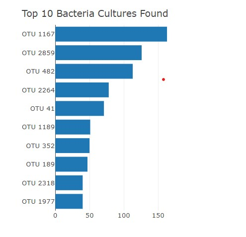
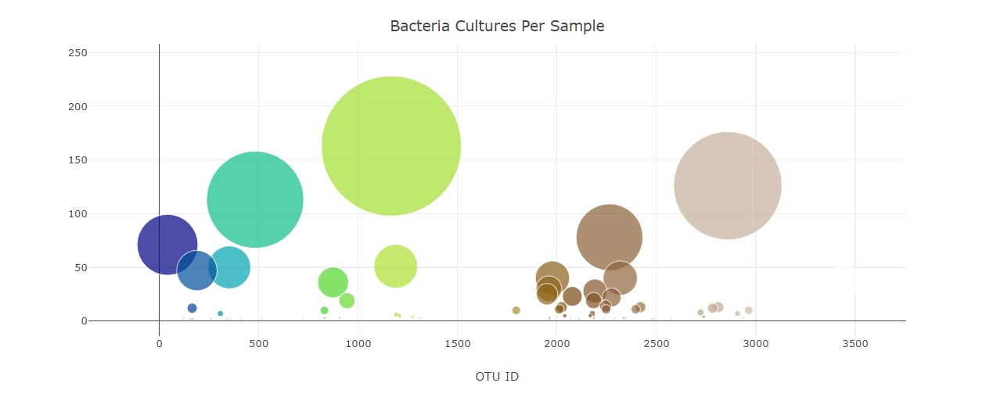
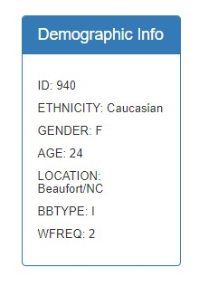
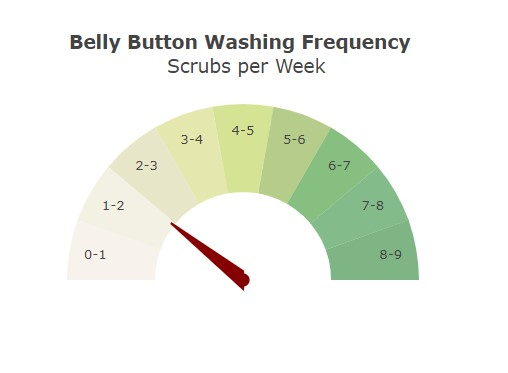

# Plot.ly Homework - Belly Button Biodiversity

In this assignment I created an interactive dashboard to explore the Belly Button Biodiversity dataset, which catalogs the microbes that colonize human navels.

# I used the D3 libary to read in samples.json.
I created a horizontal bar chart with a dropdown menu to display the top 10 OTUs found in that individual.
* Sample_values are the values used for the bar chart.
* Otu_ids are the labels.
* Otu_labels are used for the hovertext on the chart.

# I created a bubble chart that displays each sample.
* x value : otu_ids
* y value : sample_values
* marker size : sample_values
* marker color : otu_ids
* text value : otu_labels

# I created a display for an individual's demographic information.

# The dashboard updates all of the plots any time a new sample is selected.

## Bonus
I created a Gauge Chart from https://plot.ly/javascript/gauge-charts/ to plot the weekly washing frequency of the individual.
The gauge code accounts for values ranging from 0 thru 9.
The chart is updated whenever a new sample is selected.

